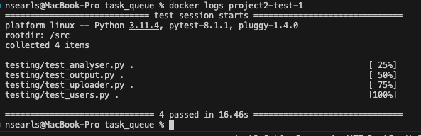

# BU EC530 NLP Analyzer Project 2

This repository contains the stub builds of APIs designed to connect to a PostgreSQL database. Follow the instructions below to set up the API backend using Docker Compose.

## Instructions

 **Clone the Repository**:

    git clone https://github.com/yourusername/ec530-project2.git
    cd ec530-project2

**Build and Run with Docker Compose**: After navigating into the project directory, use Docker Compose to build and start the API backend.

    docker-compose up -d --build

**View Logs**: To view the output of the log file, use the following command:

    docker logs project2-test-1

**Accessing Docker Images**: Docker images for this project are stored in the Docker repository `nedsearls/ec530-bu`. You can access them using Docker commands as needed.

## Screenshots

